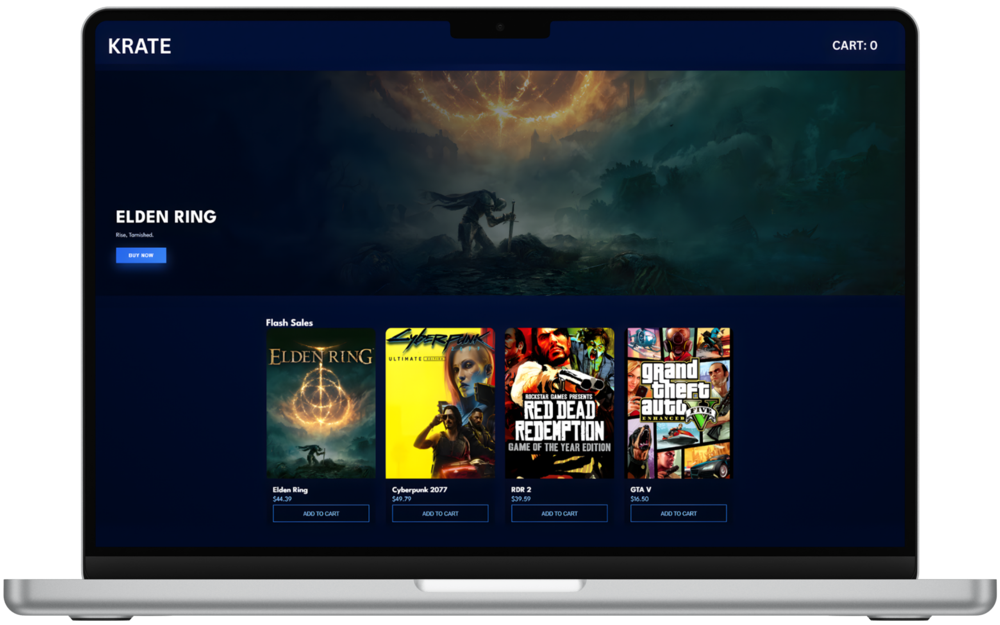

# 🎮 KRATE — Next-Gen Game Store

  

KRATE is a modern, high-performance **game store frontend** inspired by platforms like **Steam** and **Epic Games**.  
It focuses on **smooth animations**, **cinematic presentation**, and a **clean navy-blue UI** — built using pure **HTML, CSS, and JavaScript**.

This project is frontend-only and designed to be easily extended with a backend later.

---

## ✨ Features

- 🚀 Cinematic loading screen with smooth reveal
- ♾️ Infinite featured games slider (right → left only)
- 🎯 Hand-picked featured titles (Assassin’s Creed, Elden Ring, GTA V, Valorant)
- 🎨 Premium navy-blue gaming UI
- ⚡ GPU-accelerated animations (no lag / no jank)
- 🖱️ Smooth hover effects on game cards & buttons
- 📱 Responsive layout (desktop-first, mobile friendly)
- 🧠 Clean & readable code structure

---

## 🛠️ Tech Stack

- **HTML5** — semantic structure
- **CSS3** — custom animations, gradients, GPU transforms
- **Vanilla JavaScript** — logic, slider, loader control
- **Google Fonts** — League Spartan
